# Pre-deployment guide

The following documentation shows example values which should be set for the different installation options.

<!-- TOC -->
* [Pre-deployment guide](#pre-deployment-guide)
  * [Installation options](#installation-options)
    * [Configured TLS (HTTPS protocol)](#configured-tls-https-protocol)
      * [CCE ingress with autocreated ELB](#cce-ingress-with-autocreated-elb)
      * [CCE ingress with existing ELB](#cce-ingress-with-existing-elb)
      * [NGINX ingress and user provided certificate](#nginx-ingress-and-user-provided-certificate)
      * [NGINX ingress and cert manager generated certificate](#nginx-ingress-and-cert-manager-generated-certificate)
    * [Disabled TLS (HTTP protocol)](#disabled-tls-http-protocol)
      * [CCE ingress and autocreate ELB (default installation)](#cce-ingress-and-autocreate-elb-default-installation)
      * [Existing CCE ELB for ingress](#existing-cce-elb-for-ingress)
      * [NGINX ingress](#nginx-ingress)
    * [Other installation configuration options](#other-installation-configuration-options)
      * [Configure admin user](#configure-admin-user)
      * [Disable volumes](#disable-volumes)
      * [Configure volumes](#configure-volumes)
      * [Configure resources](#configure-resources)
<!-- TOC -->

## Installation options

### Configured TLS (HTTPS protocol)

- Prerequisites
    - Configured DNS in OTC for your domain - example domain `eu3.codbex.com` 
      OTC relates blog [here](https://community.open-telekom-cloud.com/community?id=community_blog&sys_id=38d6b3cf1324d050d15a246ea6744153).
      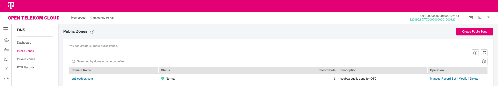
    - Record for testing subdomain (for example `rhea-demo`) which directs to the needed ELB IP
      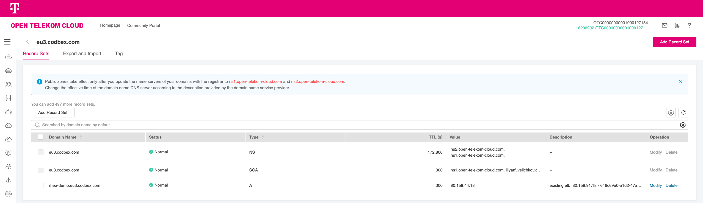

#### CCE ingress with autocreated ELB
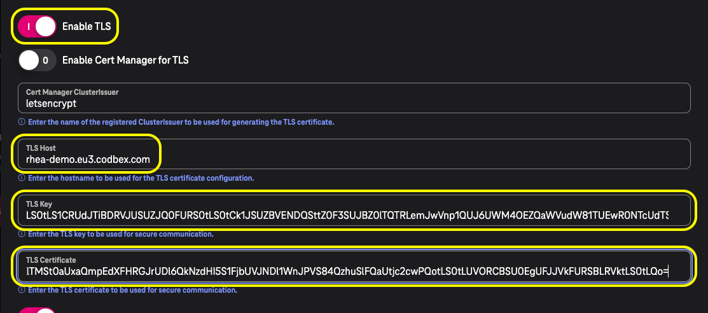

#### CCE ingress with existing ELB
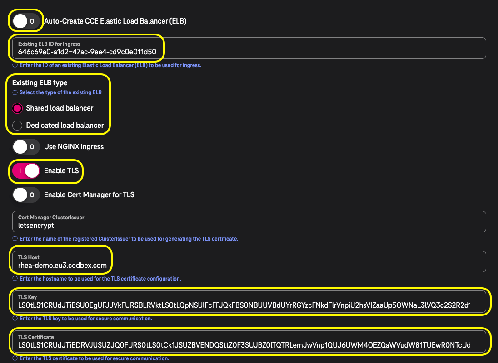

#### NGINX ingress and user provided certificate
- Prerequisites
  - Configured NGINX ingress ELB. Check [this blog](https://community.open-telekom-cloud.com/community?id=community_blog&sys_id=08f3fb40132c0190d15ac969a674412b#:~:text=own%20nginx%20ingress-,controller,-It%20is%20very) for more details.

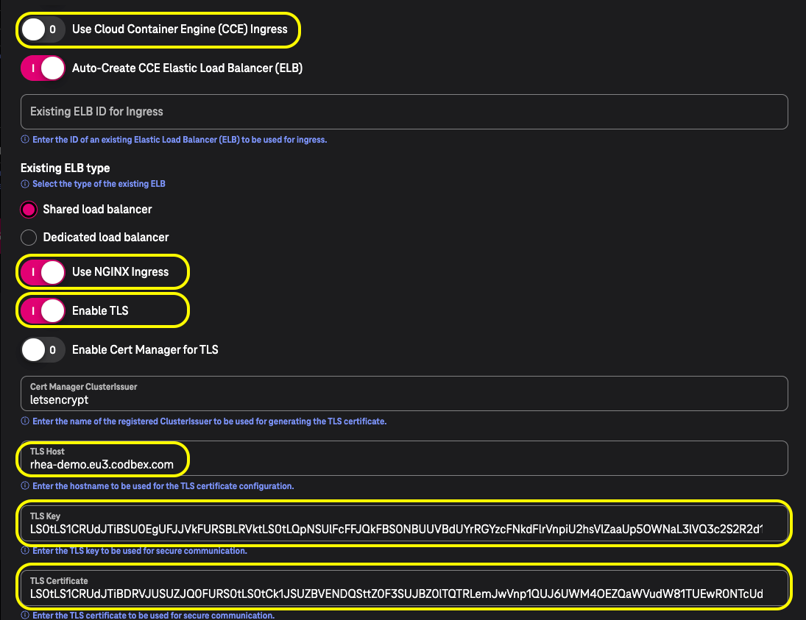

#### NGINX ingress and cert manager generated certificate
- Prerequisites
  - Configured cert-manager in your cluster. Check [this blog](https://community.open-telekom-cloud.com/community?id=community_blog&sys_id=fd976f1713529150d15a246ea67441e0) for more details.

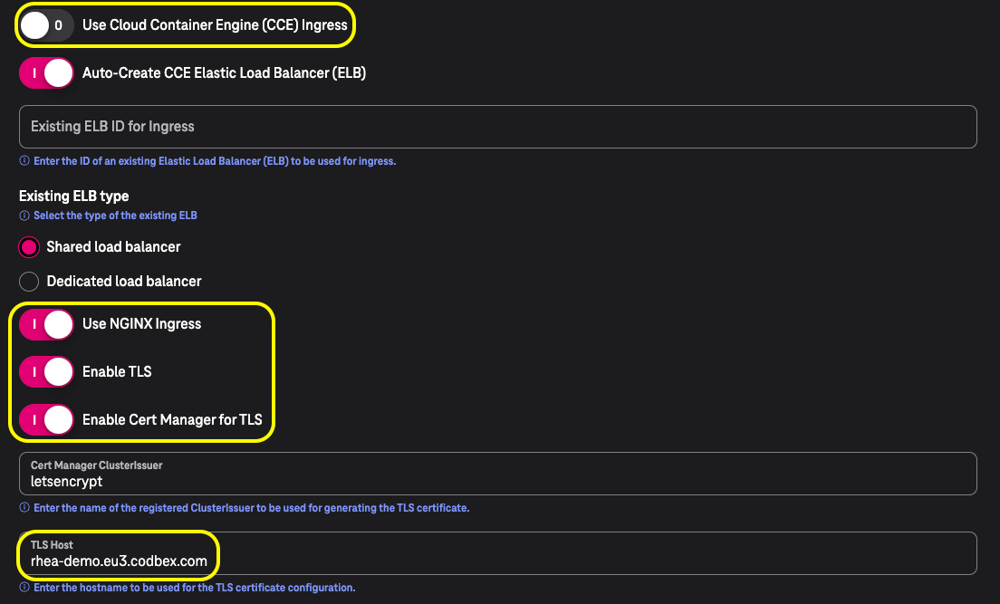

---

### Disabled TLS (HTTP protocol)

#### CCE ingress and autocreate ELB (default installation)
No additional configurations are required since this is the default setup.

#### Existing CCE ELB for ingress
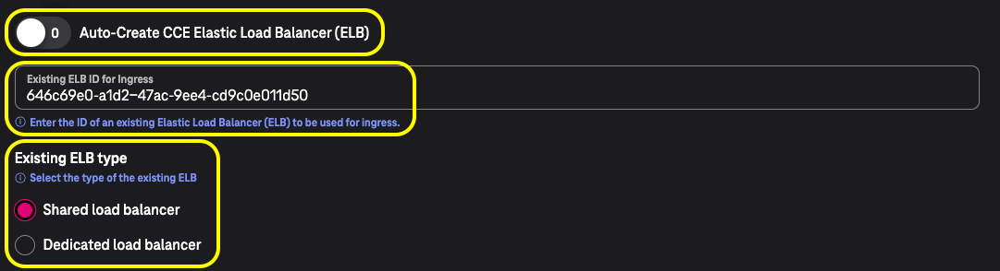

#### NGINX ingress
- Prerequisites
  - Configured NGINX ingress ELB. Check [this blog](https://community.open-telekom-cloud.com/community?id=community_blog&sys_id=08f3fb40132c0190d15ac969a674412b#:~:text=own%20nginx%20ingress-,controller,-It%20is%20very) for more details.

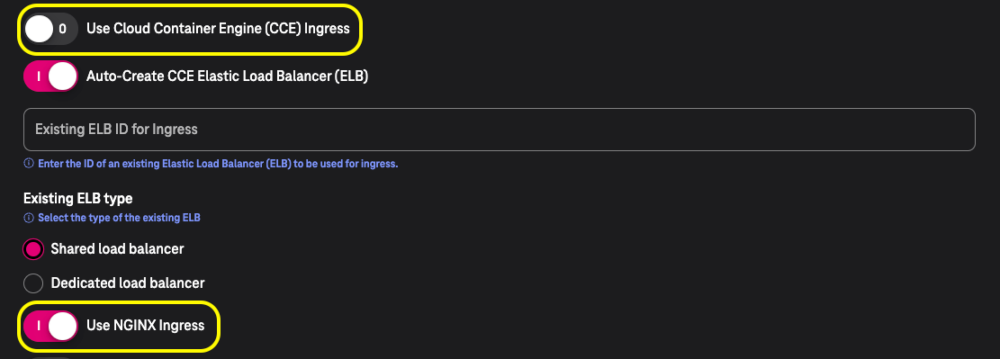

---

### Other installation configuration options

#### Configure admin user
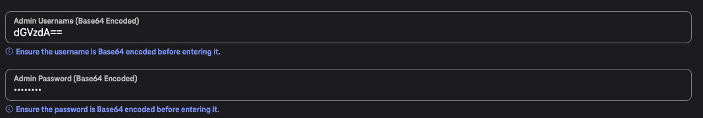

#### Disable volumes

#### Configure volumes
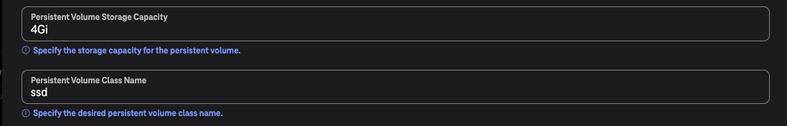

#### Configure resources
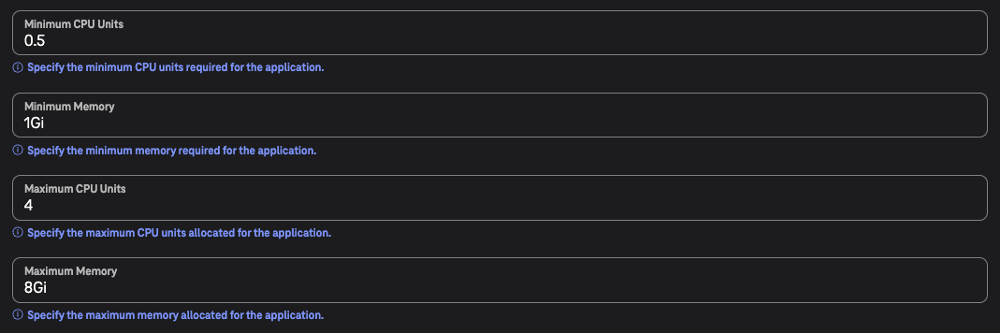
